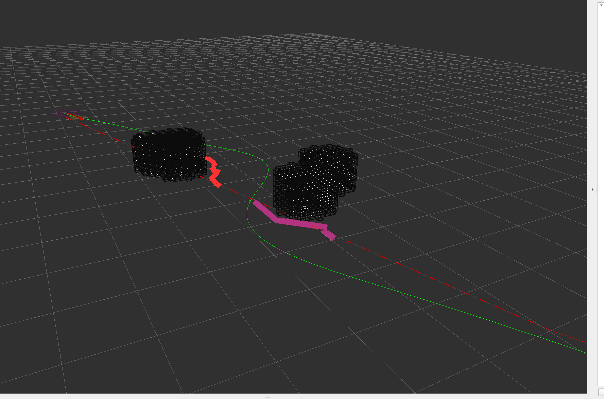

# SCAN-Planner-Pure-ROS2

[](https://docs.ros.org/en/humble/)
[](LICENSE)
[](https://isocpp.org/)

## 📖 项目简介

**SCAN-Planner-Pure-ROS2 是 SCAN-Planner 轨迹优化器的精简版 ROS 2 实现，旨在降低系统耦合度，方便开发者将核心算法快速集成到不同的软件框架和机器人平台中。**

本项目在原版 SCAN-Planner 的基础上进行了重新整理与精简，主要包括：

* 重写并简化 `grid_map` 模块；
* 移除原项目中较为复杂的决策与业务处理逻辑；
* 保留轨迹搜索与轨迹优化相关的核心算法；
* 将核心算法封装为可独立调用的 C++ 模块；
* 在核心算法外层提供轻量化 ROS 2 节点与可视化接口；
* 降低算法模块与 ROS 2 通信框架之间的耦合度。

这种设计更适合算法验证、二次开发以及跨系统移植，开发者可以根据自身项目的软件架构，对地图输入、规划触发、轨迹输出和控制接口进行适配。

> [!IMPORTANT]
> 本仓库中的默认规划参数主要针对较长距离的轨迹规划场景进行配置。
> 对于短距离轨迹优化、狭窄空间规划或不同尺寸的机器人平台，开发者需要根据实际场景调整搜索范围、采样间隔、优化权重和障碍物膨胀参数。

## 🎬 运行效果


gpt-5.5
---

## 🛠️ 编译与部署

### 1. 环境要求

推荐使用以下开发环境：

* Ubuntu 22.04
* ROS 2 Humble
* CMake 3.22 或更高版本
* 支持 C++17 的编译器
* `colcon`
* Eigen3
* Boost
* RViz2

> [!NOTE]
> 当前项目主要在 Ubuntu 22.04 与 ROS 2 Humble 环境下进行开发和测试。
> 其他 ROS 2 版本需要开发者自行验证兼容性。

本项目当前使用的开发容器名称为 `ros2_dev`，项目在容器中的路径为（docker容器名字和路径需要你自己的，如果不用docker直接部署也可）：

```text
/workspace/SCAN/SCAN-Planner-Pure-ROS2
```

进入 Docker 容器：

```bash
docker exec -it ros2_dev bash
```

### 2. 安装 ROS 2 依赖

进入容器并切换到项目目录：

```bash
source /opt/ros/humble/setup.bash
cd /workspace/SCAN/SCAN-Planner-Pure-ROS2
```

使用 `rosdep` 检查并安装缺失依赖：

```bash
rosdep install --from-paths . --ignore-src -r -y
```

如果开发环境中已经安装 ROS 2 Humble、Eigen3、Boost 和 RViz2，可以直接进行编译。

### 3. 编译项目

执行以下命令编译 `scan_planner` 功能包：

```bash
source /opt/ros/humble/setup.bash
cd /workspace/SCAN/SCAN-Planner-Pure-ROS2

colcon build --packages-select scan_planner
```

编译完成后，加载当前工作空间：

```bash
source install/setup.bash
```

检查 ROS 2 是否已经正确识别可执行程序：

```bash
ros2 pkg executables scan_planner
```

预期输出：

```text
scan_planner motion_plan
```

### 4. 一键启动 SCAN-Planner 和 RViz2

项目提供了 ROS 2 Launch 文件，启动时会自动加载仓库内置的 `rviz.rviz` 配置：

```bash
source /opt/ros/humble/setup.bash
source install/setup.bash

ros2 launch scan_planner scan_planner.launch.py
```

在服务器、Docker 容器或其他无图形界面的部署环境中，可以通过参数关闭 RViz2，仅启动规划节点：

```bash
ros2 launch scan_planner scan_planner.launch.py use_rviz:=false
```

### 5. 分别启动规划节点和 RViz2

也可以分别启动规划节点和 RViz2，方便调试。

#### 终端 1：启动规划节点

```bash
source /opt/ros/humble/setup.bash
source install/setup.bash

ros2 run scan_planner motion_plan
```

#### 终端 2：启动 RViz2

```bash
source /opt/ros/humble/setup.bash
source install/setup.bash

rviz2 -d install/scan_planner/share/scan_planner/rviz/rviz.rviz
```
### 6. RViz2 交互操作

启动项目后，可通过 RViz2 依次设置全局目标点、模拟障碍物和机器人起点。

> [!IMPORTANT]
> 请严格按照以下顺序进行操作，否则可能导致规划无法正常触发或可视化结果异常。

1. 使用 `Publish Point` 工具设置全局目标点；
2. 使用 `2D Goal Pose` 工具添加模拟障碍物；
3. 使用 `2D Pose Estimate` 工具设置机器人起点，也可以直接使用程序中的默认起点。

完成上述操作后，可在 RViz2 中观察以下可视化结果：

* 全局参考路径；
* A* 搜索路径；
* 优化后的局部轨迹；
* 障碍物及其膨胀结果。

## 🔌 主要 ROS 2 接口

### 订阅话题

| 话题               | 消息类型                                          | 说明               |
| ---------------- | --------------------------------------------- | ---------------- |
| `/initialpose`   | `geometry_msgs/msg/PoseWithCovarianceStamped` | 设置机器人当前位姿        |
| `/goal_pose`     | `geometry_msgs/msg/PoseStamped`               | 接收 RViz2 发布的目标位姿 |
| `/clicked_point` | `geometry_msgs/msg/PointStamped`              | 接收 RViz2 发布的点击点  |
| `/trigger_plan`  | `std_msgs/msg/Bool`                           | 规划启停控制预留接口       |

### 发布话题

| 话题                         | 消息类型                                 | 说明         |
| -------------------------- | ------------------------------------ | ---------- |
| `/visual_global_path`      | `nav_msgs/msg/Path`                  | 全局参考路径     |
| `/visual_local_trajectory` | `nav_msgs/msg/Path`                  | 优化后的局部轨迹   |
| `/visual_obstacles`        | `sensor_msgs/msg/PointCloud2`        | 输入障碍物点云    |
| `/trajectories`            | `visualization_msgs/msg/MarkerArray` | A* 搜索路径可视化 |
| `/inflated_cloud`          | `sensor_msgs/msg/PointCloud2`        | 膨胀后的障碍物点云  |
| `/inflated_voxel_marker`   | `visualization_msgs/msg/Marker`      | 膨胀体素可视化    |
| `/inflated_voxel_edges`    | `visualization_msgs/msg/Marker`      | 膨胀体素边框可视化  |

---

## 🚀 部署到其他 ROS 2 工作空间

将本项目克隆或复制到目标 ROS 2 工作空间的 `src` 目录中：

```text
your_ros2_ws/
└── src/
    └── SCAN-Planner-Pure-ROS2/
```

进入目标工作空间根目录：

```bash
cd your_ros2_ws
```

安装依赖并编译：

```bash
source /opt/ros/humble/setup.bash

rosdep install --from-paths src --ignore-src -r -y
colcon build --packages-select scan_planner
```

加载工作空间并启动项目：

```bash
source install/setup.bash

ros2 launch scan_planner scan_planner.launch.py
```

在无图形界面的长期部署环境中，可以将以下命令加入启动脚本：

```bash
source /opt/ros/humble/setup.bash
source /absolute/path/to/your_ros2_ws/install/setup.bash

ros2 launch scan_planner scan_planner.launch.py use_rviz:=false
```

---

## 🙏 致谢

特别感谢上海交通大学秦通老师课题组及 SCAN-Planner 原始开发团队的开源贡献。

本项目是在原始 SCAN-Planner 项目的基础上进行精简、重构和 ROS 2 适配，相关算法原理与核心思路请参考原始项目：

* [SCAN-Planner 原始项目](https://github.com/wuyi2121/SCAN-Planner)

使用本项目进行研究或二次开发时，请同时关注并遵守原始项目的开源协议及引用要求。

---

## 📢 更多信息

如果你对机器人轨迹优化、运动规划与运动控制感兴趣，欢迎关注以下媒体渠道，获取更多技术分享和开源项目更新。

### 微信公众号

**机器人规划与控制研究所**

- 分享机器人规划、轨迹优化、运动控制与工程实践内容；
- 如需加入技术交流群，可通过公众号后台联系。

[【四足机器人跨楼层轨迹优化】SCAN-Planner-Pure-ROS2 精简版开源实现【附 GitHub 开源链接】](https://mp.weixin.qq.com/s/4WeoUn6MY296VEERvW1d5g)
### Bilibili

**机器人算法研究所**

* 发布机器人算法演示、源码解析与项目实战视频。

[观看项目演示视频](https://www.bilibili.com/video/BV1Cvgv6aELJ/?spm_id_from=333.1387.homepage.video_card.click&vd_source=3e9e0488974285dd9fea47318bfd814e) 

---

## 📄 License

本项目采用 MIT License 开源协议，具体内容请参阅 [LICENSE](LICENSE) 文件。
